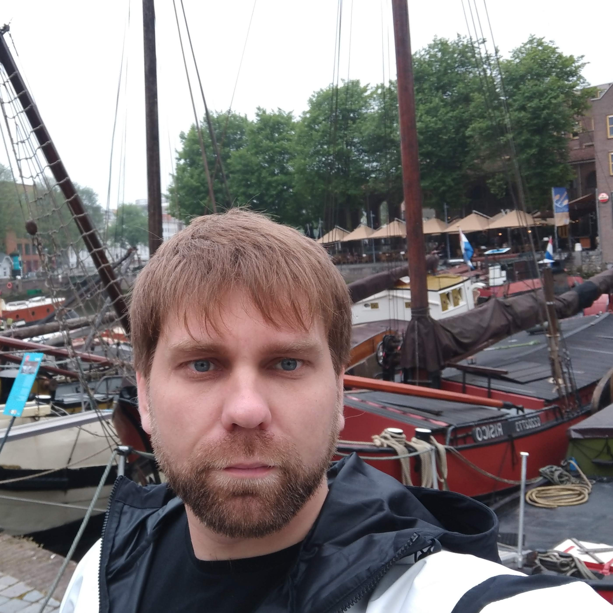

# Pavel Zubarev

 

## **My contact info**
> **address** : Kaliningrad, Russia<br>
> **email** : zubarev.p@yahoo.com<br>
> **GitHub** : ZubarevP<br>
> **telegram** : zubarevp<br>
> **discord(rs school)** : Pavel Zubarev(@ZubarevP)<br>


## About myself
I am a graduate of the Moscow Psychological and Social University. My specialty is law. For twelve years I worked as a court representative.<br> 
And now I want to change my life and I will change it.

## Skills
- C++<br> 
- CMake<br>
- Git<br>
- OS: Windows, Linux(Ubuntu)<br>

## Code example
C++ code:
```c++
#include <iostream>
#include <string>
#include <set>
#include <algorithm>
#include <cctype>

static const std::set<std::string> RESP {"yes", "y", "ok"};

bool IsPositive(std::string& resp) {
    std::transform(resp.begin(), resp.end(), resp.begin(),
        [](unsigned char c){return std::tolower(c);});    
    return RESP.count(resp)? true : false; 
}

int main() {
    std::cout << "Has Pavel Zubarev been hired?" << std::endl;
    while(true) {
        std::string resp;
        std::cin >> resp;
        if(IsPositive(resp)) {
            std::cout << "Congratulations! It's a great choice." << std::endl;
            break;
        } else {
            std::cout << "Wrong answer. Try again!" << std::endl;
        }
    }
    return 0;
}
```
## Experience
[Final task of the c++ course.](https://github.com/ZubarevP/EducationCPP/tree/main/RedBelt/6WEEK)

## Education
- [Coursera: C++ development basics (white belt)](https://coursera.org/share/e452dd6d315306750c9ee0580b360fd9) 
- [Coursera: C++ development basics (yellow belt)](https://coursera.org/share/10786d003a1f34e33d4b270e2e9315b2)
- [Coursera: C++ development basics (red belt)](https://coursera.org/share/22c66ddff09d9e4c77f0498449a9dfa2) 

## Language
english level - A2
